# Milestone 2

## Apollo

### 29 June 2025

---

### Orbital 25 SimuNUS Team

#### Huang Yuanjin

#### Huang Hau Shuan

---

**_Before you start_**

**_videos, posters, project log and source code for milestone 1 (including the original `milestone1.md` and the images) and release build can be found in this [folder](https://drive.google.com/drive/folders/10SUKK2kPEl_qIpdlfgFMivk8qsDO-FHe?usp=sharing)_**

**_For milestone 2, it is this [folder](https://drive.google.com/drive/folders/1fCDHlImy5KPQPRCwcKRYs__OIs_uRwOP?usp=drive_link)_**

### **Changelog as of Milestone 2**

- New Features
  1. Implemented campus map navigation
  1. Implemented and completed NUS Internal Shuttle Bus (ISB) transpotation
  1. Added a task panel that displays all ongoing, completed and pending tasks
  1. Added notification display
  1. Added guide input
  1. Added UI to select starting character & personal information
  1. Added in game UI to select what to do / where to go / which bus to take
  1. Added sleep (now you can sleep until the next task starts)
  1. Now simulated apps and websites can save and load data from backend
- New Maps
  1. University Health Centre (UHC)
  1. PGP
  1. NUS Campus Bus Map
  1. Refactored Hostel Map
  1. Singapore MRT Map
  1. Implemented all bus routes that runs in Kent Ridge Campus (A1, A2, D1, D2, K, BTC)
- New Tasks
  1. Registration Part One
  1. Activate NUS Email
  1. Pre-Enrollment Medical Examination Appointment
- New Simulated NUS Apps & Websites
  1. Registration Part One
  1. NUS WebMail
  1. UHC Appointment
- New Email
  1. Welcome to NUS (NUS Enrollment Cheatsheet)
- Optimization & Bug Fix

  1. Email system: now all emails are wrapped as a component
  1. Unlock app order fixed
  1. Fixed on some cases loading may fail due to ts-auto-guard returns
  1. Fixed duplicated / missing event system in unity
  1. Fixed incorrect teleportation when getting on / off bus
  1. Fixed an incorrect bus stop position on K line
  1. Fixed sometimes player can open the same app when it was already openned
  1. Fixed on some cases task completion updates does not sync with every components
  1. Temporarily patched some task might not starting when it should
  1. Fixed bugs on dragging app window, though it is still buggy when two external websites are open
  1. Fixed when renderer components failed to import utility functions and types. Now we separate a `safeUtils.ts` for them
  1. Now emails and simulated apps show the player information they input at the beginning of the game.
  1. Removed some redundant message loop within one component itself
  1. Now registration main menu don't poll data from backend. We replaced it with event system
  1. Moved `playerProfile` to context. Now all components can share it directly

- Testing
  1. Added more and more distingushable debug output (progress, default, warning, error)
  1. Added debug jump to scene to directly jump to a scene
  1. Added debug unlock task immediately
  1. Added debug complete certain steps
  1. Added default personal / registration data
- Documentation
  1. Created milestone 2 README
     - Updated repository structure, screenshots
     - Updated which features are implemented
     - Split Technical Details. We replaced it with System Details and Components
     - Updated credits
  1. Updated poster
  1. Updated video
  1. Updated time table
  1. Published new release

## 1. Project Idea & Overview

### 1. Motivation

Navigating around NUS’s and Singapore’s systems is difficult, especially for international
students. I am such one who previously knew nothing about Singapore and nobody in NUS, and having nobody to guide me I incurred actual financial costs. Although NUS did provide a checklist of what to do in `NUS Acceptance Guidelines.pdf`, it was very much incomplete: the checklist mentioned student pass application but did not specify
when and how. Additionally, a lot of critical procedures including Registration Part I, the guideline just said "more details will be emailed to you". This led to weeks of uncertainty. And it had finally arrived, it required me to complete everything in just a few days. To make matters worse, the checklist did not even mention residency application at all.

Although there were tutorials to attend and online resources to search for, nobody could **demonstrate** how to finish all the steps. In the end, due to these unclear instructions, I missed the ICA off-site enrolment slots, which delayed my STP. Without it, I could not open a bank account for GIRO or PayNow and had to pay the tuition fee with international credit card, incurring a 1% fee and losses from SGD appreciation in that month.

Besides administration, way-finding inside the NUS campus itself is difficult. Each building could have completely different levels: one building’s B1 could be F2 of another, even though the two buildings are connected. I had got lost a lot of times, especially when rushing between classes.  
I seek to channel my past struggle into making a possible solution. My team and I want to create something that would make the administrative and navigation processes easier and smoother for future freshmen (not just international students!). This project gives us the opportunity to do so in the form of a game simulation.

### 2. Aim

**SimuNUS** is an interactive NUS simulator that allows freshmen to explore and experience key administrative processes, campus navigation, and academic tasks (armed with advice from us and other seniors). Instead of guessing from incomplete instructions, search for scattered online resources, or doing things by trial and error,our project will simulate these tasks in a game – from accepting the letter offer to health checkups, from bidding classes to navigating Canvas. We hope future users could engage in the app and gain confidence to complete the real-life tasks.

### 3. Overview

In SimuNUS, players engage in an **RPG-style experience** where they complete realistic enrollment procedures, explore NUS campus and its buildings, and interact with simulated systems such as EduRec, Canvas, and many other registration systems through a **simulated desktop**.

The base game is built with Unity and deployed as a WebGL application. To simulate various online tasks, we also integrate a simulated desktop in which the player interacts with the simulated websites we created. Players can toggle between campus navigation and on-screen tasks by interacting (press the interact key) when they are next to the laptop in the game. This mimicks actual university tasks. For example, to complete Pre-Admission Medical Examination, the player needs to

1. register in simulated UHC website
2. complete part 1 of (simulated) NUS Medical form
3. take internal shuttle bus to UHC / Opp UHC
4. complete all the (simulated) procedures in UHC scene
5. (international students) upload the result to ICA

By simulating both on-screen and on-site tasks and integrating elements from RPG such as maps (including indoor maps and shuttle bus routes), quests, interactive scenarios, and NPC guides, our ultimate goal is for freshmen to get familiar with NUS while having fun. Hopefully after trying our simulator, they will be confident and fully prepared to take on university life.

## 2. Key Features

The following features / systems form the core of the application:

### 1. Game Features

- **Campus Map:**
  Players can explore our 2D maps for different sites in NUS as well as some buildings. We plan to build maps for UHC, MPSH, PGP, COM 1-3
- **NUS Internal Shuttle Bus (ISB) Simulation:**
  An in-game bus system that simulates actual NUS shuttle bus lines: A1, A2, D1, D2, K, BTC (only in main campus), E. Player can take bus on any of the bus stops and go to another stop. All the bus stops and bus routes are the same as in real life
  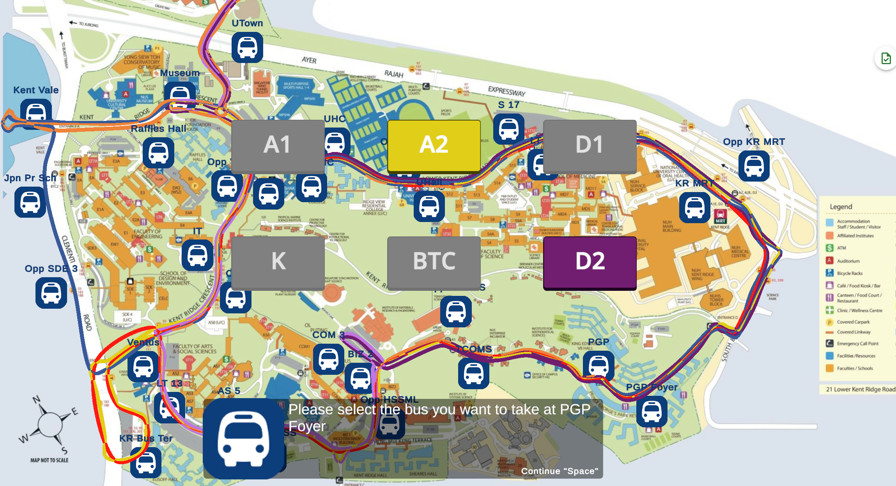
- **Simulated Desktop Interface:**
  A desktop built on react where player can open different applications that simulated real NUS systems like EduRec, Canvas. Tasks like registration or document uploads are completed through this interface.
  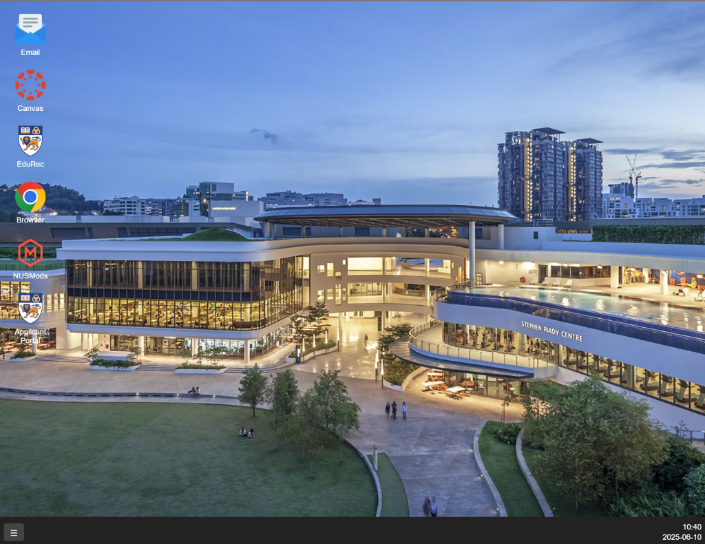
- **Tasks and Time System:**
  All the enrollment procedures and academic events are wrapped as different tasks. Players receive tasks based on real onboarding steps. A in-game time systems keep tracks of the dates to trigger tasks and record deadlines. Every task has its own "rewards" upon completing, including some visual and sound effects, receiving comfirmation emails, unlock new apps on simulated desktop, etc.
  The Detailed tasks can be found at [here](#1-main), under section `3. src/tasks.ts`
- **Guide systems:**
  We plan to add a friendly virtual guide appears throughout scenes and all applications, as well as NPCs offering advice on some spots. They will offer navigation tips, detailed tutorial on how to complete the tasks, advice from seniors and other contextual help. For tasks, there are even more detail guide, highlighting the next buttons to click, input to fill in, etc.
- **Save / Load System**
  Game states - including all tasks states and schedules - can be stored and reloaded.
- **Game Settings**
  We plan to add a settings panel to allow players set their preferred key bindings, virtual guide appearance, import and export game save, resolution and FPS, etc.

## 2. System Design

SimuNUS is composed of three several components

### 1. Unity Game Base (Frontend)

- Built in **Unity**, deployed as **WebGL**.
- Roles:
  - 2D maps rendering and player control
  - ISB map that handles bus movement and switching maps
  - Triggers tasks based on interactions
  - Time system (in-game clock)
  - UI for menus, notifications, dialogs
- Communicates with the simulated desktop and backend through JavaScript bridge (`bridge.jslib`).
- wrapped inside a `<iframe>`

### 2. Simulated Desktop

- Essentially a Web App overlay on top of unity game canvas
- Build with **React + TypeScript**, in which each app is a react component
- Roles:
  - A desktop-like environment with taskbar (which also displays in game time) and draggable apps
  - Simulated versions of NUS systems (e.g. Canvas, EduRec)
- The simulated desktop and all apps are decoupled from unity and communicate with the other components of SimuNUS via `postMessage`
  

### 3. Main Controller (Backend + Entry Point)

- The starting point of the program that runs in Electron with vite plugin
- Roles:
  - Serves the **Unity WebGL build** and **Simulated Desktop** via `Express`
  - Creates the application window
  - Keeps track of tasks procedures and schedules
    
  - Manage most of game logic except the time system
  - Save and Load the game, including game configurations

### 4. Task Panel

- A panel to display the current task progress
- Shows the detailed steps the player needs to complete
- Provides funcionalities to debug and test each task
  

### 5. Main Renderer (Central Message Broker)

The Main Renderer (Electron’s render process, or `index.html`) acts as a **central message broker** similar to Pub/Sub systems: All three components (Unity, Simulated Desktop, Backend) send messages to it, which redirects messages to appropriate recipients.


- To send messages
  - Unity: C# -> `bridge.jslib` -> `window.parent.PostMessage` (since it is embedded in an `<iframe>`)
  - Simulated Desktop and its apps: `window.postMessage`
  - Backend: `window.webContent.send`
- To listen for messages, all three components need to
  1. Register its interest in a channel by sending a special `"register_message_handler"` message with the channel name.
  2. Listens for messages
  - Unity & simulated desktop: `window.addEventListener('message', ...)`
  - Backend: `ipcMain.on(channel, callback)`
- The Main Renderer stores the registrations and delivers messages of that channel to all registered components.

## 3. Develop plan

The updated, detailed and complete table can be found at [Time Table.xlsx](https://docs.google.com/spreadsheets/d/1jvdNMGsKPCKg4VsxSEb0RdIZnZKi3kA1/)

| Week | Date             | Learn                      | tasks                              | Important Dates                         |
| ---- | ---------------- | -------------------------- | ---------------------------------- | --------------------------------------- |
| 1    | 12 - 18 May      | git                        | Repository setup                   | Poster & Video Submission (19 May, 2pm) |
|      |                  | unity foundation           | Planning & task breakdown          | Mission Control #1 (17 May)             |
|      |                  | c#, javascript, typescript | Poster (due 19 May)                |                                         |
|      |                  | Web App: React (Part 1)    | Video (due 19 May)                 |                                         |
|      |                  | electron framework         | Unity setup (WebGL)                |                                         |
|      |                  |                            | NodeJS setup (Electron)            |                                         |
|      |                  |                            | Prototype of first scene           |                                         |
|      |                  |                            | Prototype of a player              |                                         |
|      |                  |                            | Prototype of interactive laptop    |                                         |
|      |                  |                            | Prototype of a campus map          |                                         |
| 2    | 19 - 25 May      | Web App: React (Part 2)    | Simulated desktop UI               | Mission Control #2 (24 May)             |
|      |                  | Game: Unity (Part 1)       | Email app                          |                                         |
|      |                  | unity tile system          | Applicant Portal simulation        |                                         |
|      |                  | nodejs filesystem          | Implement accept offer task        |                                         |
|      |                  | unity basics               | Task system draft                  |                                         |
|      |                  |                            | Design save data structure         |                                         |
|      |                  |                            | Implement save/load functions      |                                         |
|      |                  |                            | ISB route template                 |                                         |
|      |                  |                            | Implement the player               |                                         |
|      |                  |                            | switching map logic                |                                         |
| 3    | 26 May - 1 June  | Game: Unity (Part 2)       | Basic manual save/load UI          | Mission Control #3 (31 May)             |
|      |                  |                            | Submit Photograph task             |                                         |
|      |                  |                            | In game time system                |                                         |
|      |                  |                            | Basic frontpage, menu UI           |                                         |
|      |                  |                            | Selecting starting character UI    |                                         |
|      |                  |                            | Bus transpotation prototype        |                                         |
|      |                  |                            | Design hostel room                 |                                         |
|      |                  |                            | generate Milestone 1 README        |                                         |
| 4    | 2 - 8 June       |                            | Expand UI framework                | 2 June 2pm - Milestone 1 - Ideation     |
|      |                  |                            | Browser app simulation             |                                         |
|      |                  |                            | Begin housing/visa simulation UI   |                                         |
|      |                  |                            | Pre-arrival flow logic             |                                         |
|      |                  |                            | Implement Bus transpotation        |                                         |
|      |                  |                            | expand hostel map                  |                                         |
|      |                  |                            | Campus navigation prototype        |                                         |
| 5    | 9 - 15 June      |                            | Arriving at Singapore              | Mission Control #4 (9 June)             |
|      |                  |                            | expand visa application simulation |                                         |
|      |                  |                            | implement more bus routes          |                                         |
|      |                  |                            | expand UHMS simulation             |                                         |
|      |                  |                            | UHC map                            |                                         |
|      |                  |                            | Medical Examination appointment    |                                         |
| 6    | 16 - 22 June     |                            | Auto-save checkpoints              |                                         |
|      |                  |                            | expand campus navigation           |                                         |
|      |                  |                            | MPSH map                           |                                         |
|      |                  |                            | EduRec registration simulation     |                                         |
|      |                  |                            | Implement registration part 1      |                                         |
|      |                  |                            | Medical Examination                |                                         |
|      |                  |                            | polish sprites                     |                                         |
| 7    | 23 - 29 June     |                            | Registration (Part Two)            |                                         |
|      |                  |                            | Kent Ridge MRT map                 |                                         |
|      |                  |                            | International Students Orientation |                                         |
|      |                  |                            | hostel canteen map                 |                                         |
|      |                  |                            | Course registration simulation     |                                         |
|      |                  |                            | tuition fee payment simulation     |                                         |
|      |                  |                            | Integration testing                |                                         |
|      |                  |                            | polish UI for save/load            |                                         |
|      |                  |                            | generate Milestone 2 README        |                                         |
| 8    | 30 June - 6 July |                            | implement feedback collection      | 30 June 2pm - Milestone 2 - Prototyping |
|      |                  |                            | prepare for end-user testing       |                                         |
|      |                  |                            | COM3 map                           |                                         |
| 9    | 7 - 13 July      |                            | end-user testing                   |                                         |
|      |                  |                            | bug fix                            |                                         |
|      |                  |                            | document code                      |                                         |
| 10   | 14 - 20 July     |                            |                                    | Mission Control #5 (mid-July)           |
| 11   | 21 - 27 July     |                            |                                    |                                         |
| 12   | 28 July - 3 Aug  |                            | generate Milestone 3 README        | 28 July 2pm - Milestone 3 - Extension   |
| 13   | 4 - 10 Aug       |                            |                                    | 4 Aug - Week 0 of Y2S1                  |
| 14   | 11 - 17 Aug      |                            |                                    |                                         |
| 15   | 18 - 24 Aug      |                            |                                    | 27 August - Splashdown - Refinement     |

## 4. Technologies

SimuNUS contains two major tech stacks, one for unity and the other for [nodeJS](https://nodejs.org/) (simulated desktop and main)

### 1. [Unity](https://unity.com/)

- **[Unity](https://unity.com/)**: The engine for the game world, used to render 2D campus maps, simulate bus routes, interacts with in game objects, display dialog with NPCs and manage player movement
- **WebGL Build**: This specific platform allows calling js functions defined in a jslib from C#, thus enables communication between the unity game and the other nodeJS components.
- **C#**: The language to write script for unity. The C# scripts handles game logic and data, time system, player control, UI, visual and sound effects, notification and so on.
- **.jslib**: Unity’s native JavaScript plugin for WebGL build. Used to import JS functions to C#. In SimuNUS the major role of this plugin is to send message to main renderer. More complicated logic is handles elsewhere
- **Tile map**: Used to create 2D campus map
- **Spline**: Used to build bus route

### 2. Simulated Desktop (Web App)

- **[React](https://react.dev/)**: A frontend framework for us to build user interfaces out of individual pieces called components. Each simulated application, as well the the simulated desktop itself, are react all components
- **TypeScript**: A strongly typed language that ensures type safety at compile type.
- **HTML/CSS**: Used to create the layout and styles for the app window and simulated NUS websites
- **[Vite](https://vite.dev/)**: Lightweight, fast bundler and dev server for React and TS projects. It provides hot module reload (HMR) in develop phase and optimizes the build
- **[Material UI](https://mui.com/material-ui/)**: MUI offers a comprehensive suite of free UI tools. SimuNUS uses it to build its interfaces except simulated NUS website / apps.

### 3. Backend

- **[Electron](https://www.electronjs.org/)**: The framework to creates browser windows and manages the overall app lifecycle. It also provides `ipcMain` and `ipcRenderer` to communicate between frontend and backend.
- **[electron-forge](https://www.electronforge.io/) with vite plugin**: The tool to build the whole app.
- **[Express](https://expressjs.com/)**: The library to serve the unity build. It allows customized headers that allows the browser to automatically unzip `*.br` in unity build
- **[Chalk](https://github.com/chalk/chalk)**: A library for customized CLI output. It helps us debug.
- **Json**: The game save is serialized using json format and stored on local machine

## 5. Run / Build SimuNUS

### 1. Release

- Download the release zip file from
  1. **Milestone 1**: download it from [here]()
  1. **Milestone 2**: download it from [here]()
- Unzip it
- Open SimuNUS.exe and try it out yourself
- Although the packages SimuNUS uses are all cross-platfrom, we have not yet built for Mac and Linux in milestone 2. You may read next part and build yourself for different platforms

### 2. Build SimuNUS yourself from [Source Code](https://drive.google.com/file/d/1zfAj83E7Si0K9xFmT5eKFs76-IR7B_ik/view?usp=sharing)

#### 1. Repository Structure (As of milestone 2)

```
SimuNUS
├─public
│  ├─background                  # Background images for desktop and apps
│  └─icon                        # Icons for desktop and apps
├─pictures                       # Diagrams, screenshots for documentation (milestone2.md)
├─src                            # Source code root
│  ├─main.ts                     # Electron entry point
│  ├─gamedata.ts                 # Task and game state manager
│  ├─tasks.ts                    # Task definitions and utilities
│  ├─types.ts                    # Shared interfaces, enums and types
│  ├─types.guard.ts              # Type guard functions for runtime checks
│  └─renderer                    # All frontend (renderer) source code
│     ├─apps                     # React components for simulated apps
│     │  ├─css                  # CSS styles specific to each app
│     ├─context                  # React contexts (opened apps, player profile, etc.)
│     ├─profile                  # Player profile form shown at start of the game
│     ├─task_panel               # In-game task panel UI
│     └─simdesktop               # Simulated desktop (desktop icons, taskbar, app window manager)
└─unity                          # Unity project directory
   ├─Assets
   │  ├─images                   # UI backgrounds and interface images
   │  ├─prefabs                  # Reusable prefabs (laptop, bus, etc.)
   │  ├─Scenes                   # Scenes for main menu, player room, bus maps, etc.
   │  ├─scripts                  # C# scripts and bridge.jslib
   │  ├─Settings
   │  │  └─Scenes
   │  ├─Sprites
   │  │  ├─campus map            # Sprites for campus layouts
   │  │  ├─furnitures            # Furniture and room decorations
   │  │  ├─tiles                 # Tile sets
   │  │  └─Materials             # Sprite materials
   ├─Packages
   └─ProjectSettings
```

#### 2. Build Instructions

- Prerequisites
  - [Node.js](https://nodejs.org/en) (We use v22.15.0)
  - [Unity](https://unity.com/) (6 with WebGL build support)

1. Clone the repository (since orbital requires the github project to be private, you can download it [here](https://drive.google.com/file/d/1zfAj83E7Si0K9xFmT5eKFs76-IR7B_ik/view?usp=drive_link))
1. Open unity/ in Unity editor
   - Set build target to WebGL
   - Build the project to /public/unity_build (it may take more than 10 minutes)
   - _Alternatively, if you don't have Unity 6 installed, you can download the separate unity build [here](https://drive.google.com/file/d/1PuU1EPYlBaGPvbGuajIZY8e4GMcy2rDZ/view?usp=sharing) and unzip it under /public/unity_build_
1. Run SimuNUS
   ```bash
   npm install
   npm run start
   ```
   Or run `npm run make` to build, the build will be under `out/`

## 6. SimuNUS System Details

### 1. Task System

#### 1. Tasks Overview

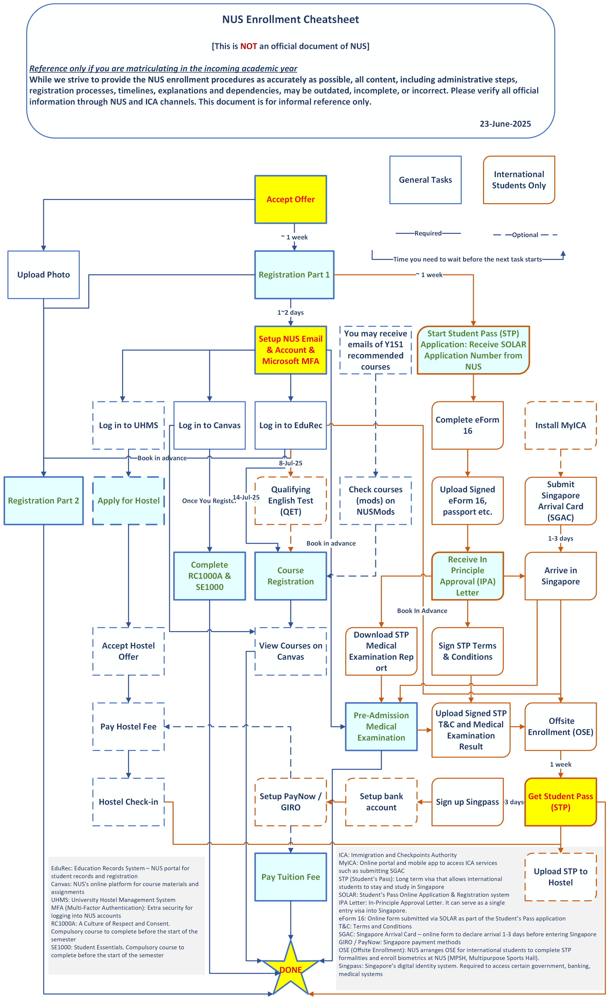

We are implementing the enrollment tasks according to the actual enrollment procedures. Our task system follows the timeline and dependencies of it.

#### 2. Task Execution


- Manages tasks defined in `src/tasks.ts`
- Handles tasks and their respective steps' status (`NotStarted`, `Ongoing`, `Finished`, `Failed`)
- Task Scheduling

  - When the prerequisite of a task it met, backend send message to unity in game timer to schedule the task. Once a task is registered, the sceduled time will be stored in game save, thus reloading won't change the date and status of a task
  - At startup, tasks are registered based on status:
    1. Immediately happen
    1. Absolute start time → schedule directly
    1. Relative time → listen for trigger message, then schedule

- Task Excution

  - Tasks consist of **steps** (`TaskStep`), and some steps have **playerSteps** (`PlayerStep[]`) while others are solely the instructions of what the system do: send email, unlock app, etc.
  - Each step is assigned to one of: `"main"`, `"unity"`, `"laptop"`
  - Different implementations for static steps (no player action required) from interactive ones
  - Tasks on unity are implemented in unity, here it sends the instructions to `setUnityPlayerNextSteps` and listens `playerCompletedUnitySteps` for completion. However, if the prequisite for the next task is already satified, it may skip this task.

- Task Completion

  - There are 2 ways of completing a task
    1. All of its steps are done
    2. Receives the completion message
  - Upon completing a task, it sends `taskComplete` and perform all the static tasks in `completedResult`
  - The completion message will triggers notification and a cheerful sound in unity. It may also unlock the next tasks

- Task Failure
  - The players may fail a task if they
    1. Interact with the wrong components ~~(e.g. click the button to reject the NUS offer)~~
    2. Failed to meet the deadline
  - Upon failing a task, it sends `taskFail` and perform all the static tasks in `failedResult`, which may includes jumping to the game over scene

#### 3. Task Guide System

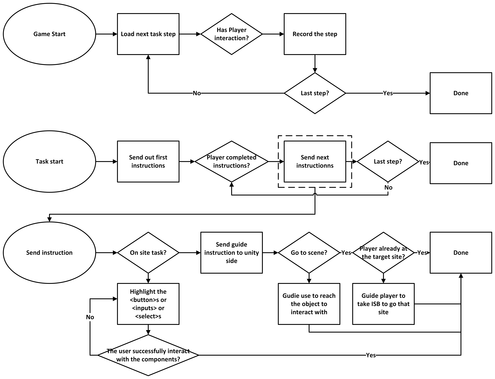

- The guide for on-screen or on-site tasks
- For each on-screen step the player needs to do, it sends message to simulated desktop, which will then highlight the components that the player needs to interact with. For example, to guide a user to click a button, it sends out `guideClick_<id>`.

  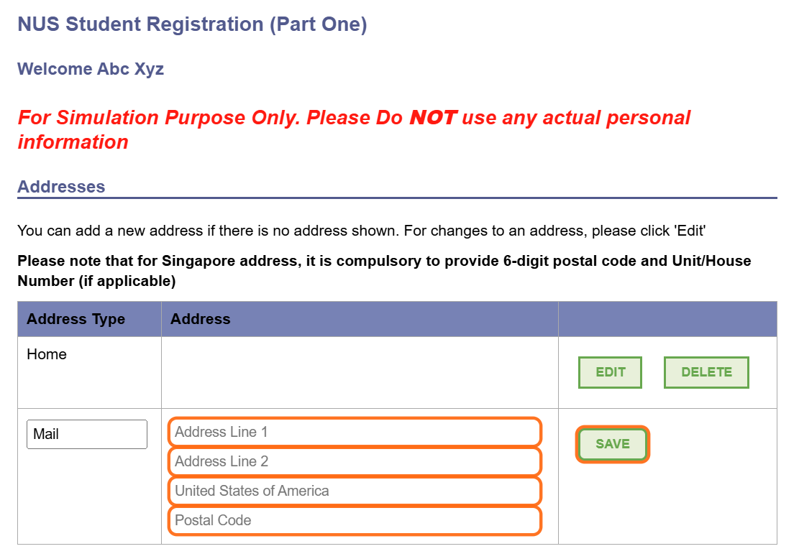

- on-site task guide system not implemented as of milestone 2

### 2. Navigation system

#### 1. Bus teleportation system


#### 2. Navigation guide system

Not implemented as of milestone 2

## 7. SimuNUS Components

### 1. Main (Backend)

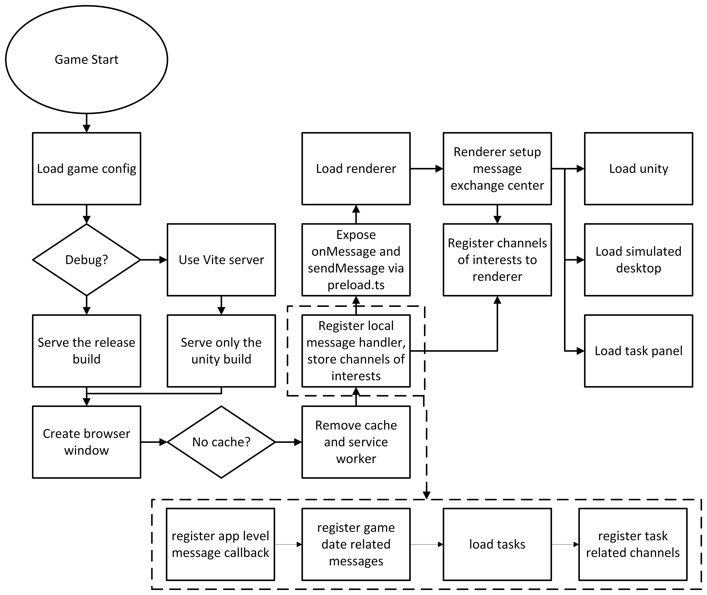

1. `src/main.ts`: the **entry point** of the SimuNUS Electron application

   1. Create Browser Window
      - Configured via `BrowserWindow` with settings for: WebGL support, Preload script (`preload.js`), security, fullscreen, dev tools, or no-cache according to game config
   2. Setup Local Server (via `express`) which listens on `config.SERVE_PORT`
      - Adds correct headers for `.br` and `.gz`, and WebAssembly MIME types (e.g. `.wasm.br`, `.wasm.gz`)
   3. Message Handling - Defines `sendMessage`, `onMessage`, `onceMessage`, and `forwardMessage` utilities. These functions will be used for in all parts of backend.

      - For `onMessage` and `onceMessage`, we add a parameter to determine whether sending register message to main renderer over channel `register_message_handler`

      - It stored these registrations in to_register and actually register them after the main window (main renderer) finishes loading `did-finish-loading`

   4. Handles App level commands: `exit`, `reload` (in debug mode)
   5. Call handleGameSaveMessage() defined in `gamedata.ts` and pass `sendMessage`, `onMessage`, `onceMessage` to it.

2. `src/gamedata.ts`: manages **game state**, **tasks**, **save/load**. It implements most of the features for handling game data.

   

   1. Save/Load System
      - Uses `GameSave` class to store:
        - `unitySave`: serialized string from Unity
        - `receivedEmails`: email metadata. The contents of the email are defined separately and loaded on demand in simulated desktop
        - `tasks`: array of taskStatus, stored the task states
        - `unlockedApps`: which desktop apps are available
        - `playerProfile`: the personal information for the player
        - Other fields: store the data from simulated apps
      - `onMessage("save")` serializes `gameSave` and writes to file
      - `onMessage("load")` deserializes and updates Unity and desktop via `sendMessage`. Here we also checks if the deserialized object matches the type to ensure type safety. The checking functions are defined in `src/types.guard.ts`
      - Added message handler to set and get data for a specific app. (e.g. `registrationData` for Registration Part 1, `appointments` for UHC Appointment)
      - the game save location is configurable in `src/SimuNUS_config.ts`
      - All the `sendMessage`, `onMessage`, `onceMessage` are passed from `src/main.ts`
      - **All the data types, including all interfaces, enums for email system, unlock apps, tasks system are defined in `src/types.ts`**
   2. Email system
      - `sendEmail(id)` Add an email to `gameSave.receivedEmails` and notify Unity
      - `getEmailList`: get emails from `gameSave.receivedEmails`
      - `markEmailRead`: set the unread attribute of an email to `false`
      - `getHasNewMessage`: check and send whether any email is unread
   3. Task system

3. `src/tasks.ts`: Defined the structure, timing, and progression of tasks and the utility functions to create tasks. The excution of the task system is implemented in `src/gamedata.ts`

   1. Task Structure - Each task is defined as a `TaskDetail`
      - `name` and `description`: the name and description of the task
      - `startTime`: When to trigger the task (absolute, relative or random)
      - `steps`: An array of `TaskStep`s
        1. `node`: Defined where the task should be executed - `"main"`, `"unity"`, or `"laptop"`.
        2. optional `function` and `params` that defines what the system should do. e.g. `sendEmail`, `unlockApp`
        3. optional `playerSteps` for interactive tasks requiring user action
      - `completedMessage` / `failedMessage` (optional): The channel name of trigger messages to mark task as complete or failure
      - `completedResult` / `failedResult` (optional): Steps to execute upon success/failure. They are static TaskStep[] that will be executed immediately after the task is done
   1. Task Initialization:
      - `newGameTaskCompletion()`: it creates a new `TaskCompletion` object with all states of all tasks and their steps to `NotStarted`, currentPlayerStep to `0`
   1. Other utility functions

### 2. Renderer

#### 1. `index.html`

The entry for the whole renderer program. Beside creating the root element, it is also where the message exchange center is implemented

#### 1. `src/renderer/main.tsx`

The entry point of the simulated desktop. It adds the simulated desktop, task panel and message component into the DOM element with ID `simdesk-root` with `StrictMode` and `AppProvider` (see `context/AppProvider.tsx`)

#### 2. `src/renderer/simdesktop`: Simulated Desktop


1. `src/renderer/simdesktop/App.tsx`
   1. Control when the simulated desktop is shown. It listens for `hideSim` and `showSim` to show and hide the desktop; `getSimStatus` responds with whether the desktop is shown
      - It also hides simulated desktop when clicking outside of it or when pressing ESC
   2. Render desktop components: wallpaper, taskbar, and app windows (one for each app)
1. `src/renderer/simdesktop/context/AppProvider.tsx` and `src/simulated_desktop/simdesktop/context/AppContext.ts`: the context for simulated desktop

   1. This React context stores and manages **app window state** (open/close/focus) in the simulated desktop.
      - `openApps`: list of all open apps
      - `playerProfile`: Player Profile
   1. Provide methods to:
      - `openApp(appMeta)`: Open a new app
      - `closeApp(app | name | "*")`: Close an app or all apps
      - `bringToFront(app)`: Bring an app to the front (set its `z-index` to be the highest)
   1. Export the `AppContext` via `AppContext.ts` (in vite, and tsx/jsx file should only contains one component in order to hot reload)
   1. Load playerProfile when mounted. Listens from backend for any updates

1. `src/renderer/simdesktop/AppWindow.tsx`: App Window Component

   

   1. Renders a title bar that the player can drag, focus or close the app
      - The `x` button inside the title bar calls `closeApp(app)` from AppContext to close the app
   2. Read the z-index from appContext to position the app correctly
   3. When dragging, it adds an overlay to prevent the inner app from capturing the mouse movement message (when `<iframe>` and `<webview>` captures the message, the parent window cannot receive it)
   4. Render the inner app

      - Uses `position: absolute` to manually place the window and enable dragging
      - Renders the app's React component from `app.appmeta.component`
      - Optinally pass the props from `app.appmeta.props` to the app

1. `src/renderer/simdesktop/Desktop.tsx`

   1. Request the list of unlocked apps from the backend and listens for unlocked apps

      - On mount (`useEffect`):

      1. Registers a listener for `setUnlockedApps` to receive the unlocked app list
      1. Sends `getUnlockedApps`
      1. Filters and maps unlocked names to actual `AppMeta` according to `appRegistry`
      1. Call `setApps` to set the apps

   2. render one `DesktopIcon` component for each unlocked app

1. `src/renderer/simdesktop/Taskbar.tsx`

   

   1. Renders the `Clock`, `StartMenu` and the buttons for open apps
   1. When clicking the buttons, it brings the app to the front

1. `src/renderer/MessageBridge.ts`: Provides functions to send and listen for messages from main renderer

   1. `SendToSimuNUS(channel: string, data: unknown)`

      - Send messages to main renderer, which will then redirect the message to unity or backend
      - It handles both when simulated desktop is embedded inside a `<iframe>` or not
      - Push messages to `toSend()` if the message bridge is not ready (i.e. the main renderer have not registered all channels) and sends them on `messageBridgeReady`

   2. `onSimuNUSMessage(channel: string, callback: (data)=>void)`

      - Add the callback functions to `registered` and `window.SimuNUS_API.onMessage` (which is actually `ipcRenderer.on` exposed from `preload.js`)
      - the callback functions will be called when receiving the message no matter from the backend or from unity
      - if running inside an `<iframe>`, is also sends `register_message_handler` to main renderer

   3. Debug utilities

      - Three functions (`dbgLog`, `dbgWarn`, `dbgErr`) to directly send the debug messages to backend to log them to stdout. The backend ignores them if in release build

#### 3. `src/renderer/task_panel`: Task panel


1. Display task info and progresses

   - Task name and description
   - Task status (Not Started, Waiting, In Progress, Completed)
   - For task steps it only tracks sub steps that require player actions.
     It creates a progress bar of completed steps / total steps
   - Ignore locked (not started) tasks be default. However in debug mode there will be a button to enable showing all tasks

2. Get `taskDetail` and `taskProgress` from backend

   - Register over channel `setTaskProgress` and `setTaskDetail` when mounted and send message to get them.
   - Whenever the task progresses are updated, new game starts or loads game, the backend will send `setTaskProgress` so inform this component

3. In debug mode, it also creates buttons to show all tasks and start a task immediately.

### 3.Unity

1. MainMenu: The starting point of the whole game. It creates

   

   1. The main menu UI (`unity/Assets/scripts/MainMenu.cs`), including buttons for

      - `New Game`: Creates a new game. It also sends `newGame` message to the main renderer which redirects the message to backend
      - `Load`: Sends `load` message and listens for game data
      - `Settings`: Open settings panel (Not implemented as of milestone 2)
      - `Exit`: Sends `Exit` to main to exit game
      - Buttons to debug the a specific scene

   1. In game menu (`unity/Assets/scripts/InGameMenu.cs`). the menu will appears when the user press ESC. However, even through it is created here, it won't show up until the game starts

      - `Save`: ask the gameDataManager to send the game data to main
      - `Load`: ask game data of the previous save from main
      - `Return to game`
      - `Settings`
      - `Exit to main menu`
      - `Exit`
      - This menu will be added to DontDestroyOnLoad (`unity/Assets/scripts/PersistentObject.cs`) to make sure it exists in all scenes

   1. Timer (`unity/Assets/scripts/GameTimeManager.cs`): the object that manager in game time. In game time speed can be set in inspector window for now, or settings panel once it is implemented.

      - updates in game time every time `update()` is called and `isPaused` is `false`
        - If not paused, accumulates Time.deltaTime
        - Once it reaches realSecondsPerTick, calls AdvanceMinutes
      - Minute, Hour, Day, and Month all support overflow and underflow. Which means it is safe to call `Minute += 100` or `Day -= 32`
      - schedule tasks
        - Responds to schedule message in backend
        - When the time come, send message to activate the task

   1. GameDataManageer (`unity/Assets/scripts/GameDataManager.cs`): The object to manage all game data
      1. Defines data structures for game save and config
         - `GameConfig`: global config like debug mode and save path, after milestone 2 we will add more configurations
         - `PlayerStatus`: Tracks location (`transition`), personal info, and state of the player
         - `GameSave`: Full save object with scene info, player status. We have moved the game save for tasks and playerProfile to SimuNUS backend
      1. `NewGame()`: Creates new GameSave instance and inform the backend
      1. Receives and parses configuration and save data sent from the backend
      1. Updates game data when it receives data from backend or starting new game:
         - Jump to `gameSave.currentScene`
         - restores player status according to: `playerStatus`
      1. Tracks game time and scene transitions
         - Keep tracks of current and previosu scene
         - The time here is only updated when calling `save()` or `load`

1. Rooms (Player home and hostel room)

   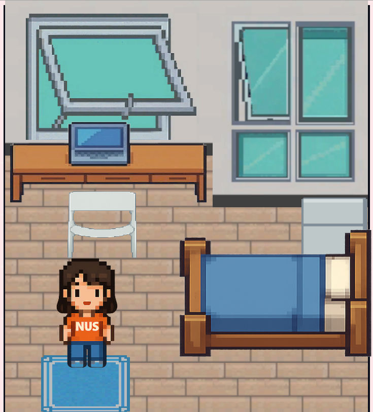

   1. Laptop (`unity/Assets/scripts/Laptop.cs`): Yes this is where the simulated desktop is in the game

      - A Circle collidar object to check if the player is near
        - On `OnTriggerEnter2D`, sets `isPlayerNear = true`
        - On `OnTriggerExit2D`, sets `isPlayerNear = false` and hides simulated desktop
      - Show/Hide Simulated Desktop
        - `Update()`: if player is near and presses interaction key, it sends message to show simulated desktop
        - Hides desktop when player walks away
      - Exclamation Mark to indicate if there are new emails.

   1. Door (`unity\Assets\scripts\TeleportPoint.cs`): the door object is just a sprite with a TeleportPoint component. All the bus stops, doors and any object that triggers teleporting has this component

      - Go outside or jump to a bus stop.
      - Show a option for the user to choose or cancel

   1. Other decorations
      - furnitures
   1. Player (`unity\Assets\scripts\PlayerControl.cs`)
      - WASD control movement and sprites
   1. Bed
      - The player can walk a close to the bed and press the interaction key to select whether and how long to sleep
      - Sleep until the next morning or to the next scheduled task.

1. Campus Map

   1. Map of NUS
   1. 29 Bus Stops in Kent Ridge campus
      - Positioned according to their actual position in NUS
   1. 6 Bus Routes for each bus line

      - Essentially a spline object with all points positioned according to real bus route
      - Stores which points are the position of which bus stops in `List<BusStopPair> busStops`
      - Controls bus movement and teleportation
        - `MoveImmediatelyToStop(string stopName)`: Instantly moves the bus to a specific stop.
        - `MoveBus(startStopName, targetStopName, nonStop)`: Animates the bus along the spline route.
        - `MoveAndStopAtEach()`: Coroutine that moves and pauses at stops.
          - It also show toast like `We are arriving at ...` when arriving at a stop
          - Enables getOffButton during stop, which triggers `GetOff()` if clicked.
        - `MoveAlongSpline(startKnot, endKnot)`: Coroutine that moves the bus along the spline without stopping
      - `GetOff()`: Change the scene to either the map for that bus stop or the room if arriving at the player's hostel (or shows not implemented)

   1. BusManager (`unity\Assets\scripts\BusManager.cs`)

      - Registers all bus route GameObjects (assigned in inspector window)
      - Implements get on and get off the bus logic
        - Determines current stop based on `GameDataManager.instance.GetPreviousSceneName()`.
        - `GetOnBus(string stopName)`: Promp the user to choose one available line. Calls MoveBus() on that line to start from this stop.
        - `GetOff()`: calls `GetOff()` of the current line

   1. Bus (`unity\Assets\scripts\Bus.cs`)
      - The object to be moved on the map
      - can set the logo of the lines by calling `SetBusLine(string busline)`

1. Singapore Map

   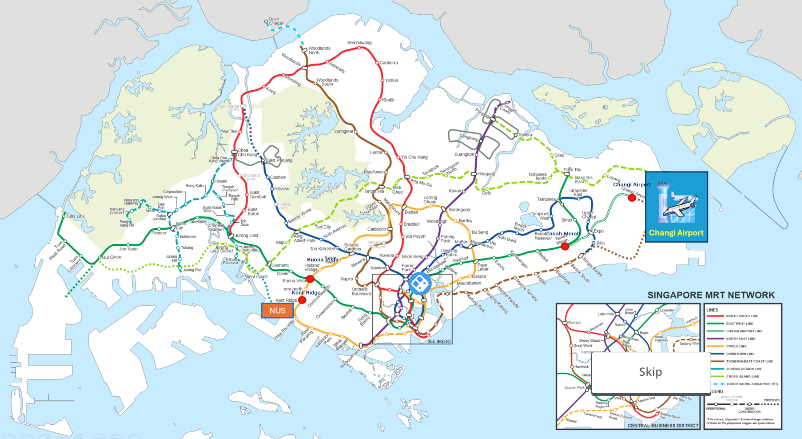

   - A map to simulate how to take MRT to NUS after arriving at Changi Airport for international students
   - Reuses the code and logic for bus routes

1. Other Scenes

   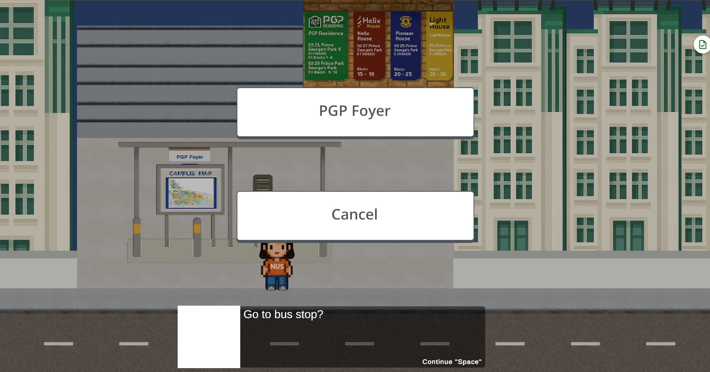

   - We are implementing other scenes. As of milestone 2, we added UHC scene and PGP scene.
   - Each scene has minimally the following objects
     1. Bus Stop. When moving near the bus stops the player can select whether they want to go get on bus here
     1. Buildings. When moving close to the buildings the user can press the interaction key to enter the building (jump to the inner map for that building)

1. Message Bridge (defined in `unity/Assets/scripts/bridge.jslib`, imported to C# in `unity/Assets/scripts/MessageBridge.cs`)

   - `SendMessage (string channel, string data)`: send any string message to main renderer, which will then redirects the message to intended listener.
   - `RegisterUnityMessageHandler(channelName, gameObjectName, methodName, stringify)`
     - Call gameObject.methodName in Unity via Unity's build in function `SendMessage`. This is not the same as the previous `SendMessage` and is only available in `.jslib`
     - Each channel can only be registered once. This is because even if the GameObject is destroyed and recreated, unity can still forward message to it
     - Add event listener to listen from the main renderer

### 4. Simulated Apps

1. `src/renderer/apps/appRegistry.ts`: registers all apps in simulated desktop

   1. Centralized definition of all apps as an `AppMeta` object

   ```ts
   interface AppMeta {
     name: string; // Display name and unique id
     icon: string; // Path to icon image. the icons are stored in public/icons
     component: React.FC<any>; // React component to render in AppWindow
     props?: Record<string, any>; // Optional props to pass to the component
   }
   ```

   - This design enables creating window for all different types. It also helps the desktop and taskbar component to render the name and icon of the app.
   - It also makes our life easier by making adding apps as simple as putting it to apps_array without changing the rest of the code.

1. `src/renderer/apps/NUSApp.tsx` - A template for most of the NUS apps.

   - We found that most of NUS apps contains a similar login page which then jump to a main page.
   - NUSApp is a tamplate to simulate this universal login process to reuse code and unify the login process
   - It create a state `login` to track whether the user has login to the system. When login is false, it displays the login component. Otherwise it displays the main component.
   - `setLogin` is passed to login page and main page as props

1. `src/renderer/apps/ApplicantPortal` - NUS Applicant Portal

   

   - A simulated version of [NUS Applicant Portal](https://myaces.nus.edu.sg/applicantPortal/app/).
   - We created the simulated page for login, main page, home page and admission page
   - A fully functional navigation bar to switch pages
   - The player needs to accept offer on this platform. Alghough in real like they actually accept the offer on another platform like JAP

1. `src/renderer/apps/PhotoVerification`

   

   - Simulated version of [Online Photo Verification](https://myaces.nus.edu.sg/photoVerification/)
   - Implemented the photo submission functionality as well as the online photo resizing functions
   - The photo will be converted to base64 text and submitted to main on `submitPhoto` channel. A message on `photoSubmitted` will be sent if the photo is saved successfully
   - Backend then converts it back to jpg and stores it locally. In the future this photo will become the avator of the player on Canvas, EduRec, Student Card, etc.

1. `src/renderer/apps/Email.tsx`

   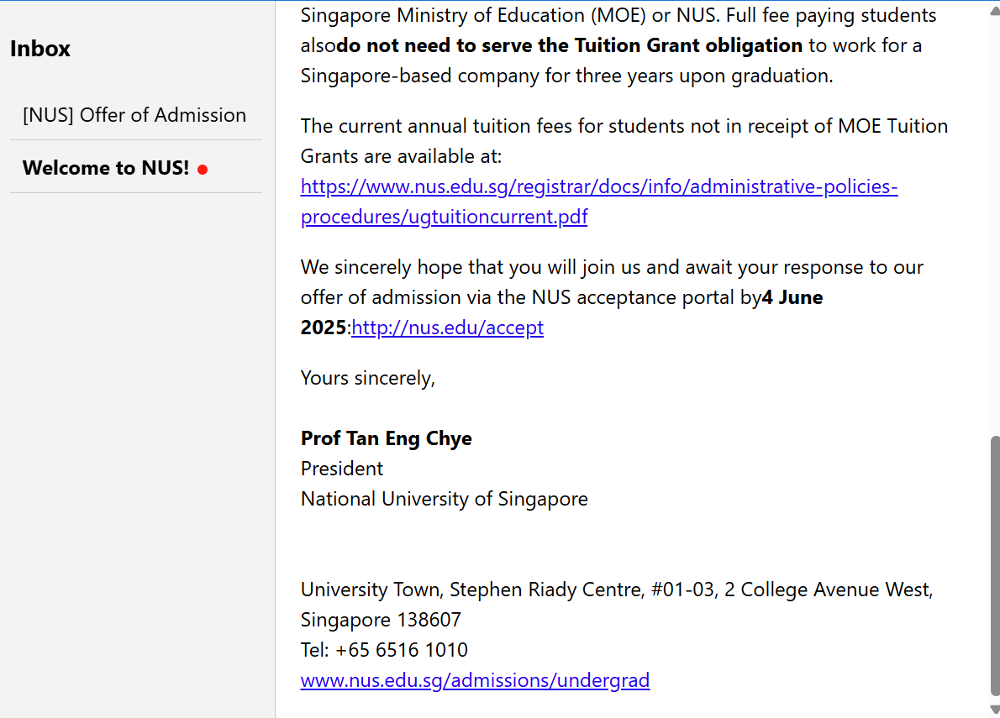

   - An email app to receive and view in game emails the player receive
   - It loads unlocked emails and whether the player has read them by sending over `getEmailList` and listening from `setEmailList`
   - When the player read any email, it sends `markEmailRead` to backend to mark the email as read
   - The email body is a component defined under `src/renderer/apps/emails`
   - `src/renderer/apps/emails/registry.tsx` records the email id to components mapping, and loads the corresponding component as `EmailBody` according to email id

1. `src/renderer/apps/Browser.tsx`

   - An app to open external websites like NUSMods. It can also open external pdf like `NUS Code of Student Conduct`
   - It uses `<webview>` tag provided by electron since most websites like google does not work in an `<iframe>`
   - Any other app or any part of SimuNUS can simply sends `openBrowser` with the link as message payload. The simulated desktop listens this channel and will then open browser app with the link.
   - As of milestone 2, it can only one extertal website. In the future we plan to add support for multiple tabs.

1. `src/renderer/apps/RegistrationPart1`

   - _main menu_

   

   - _example sub pages_

   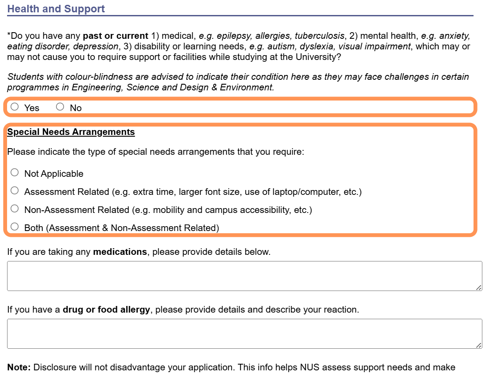
   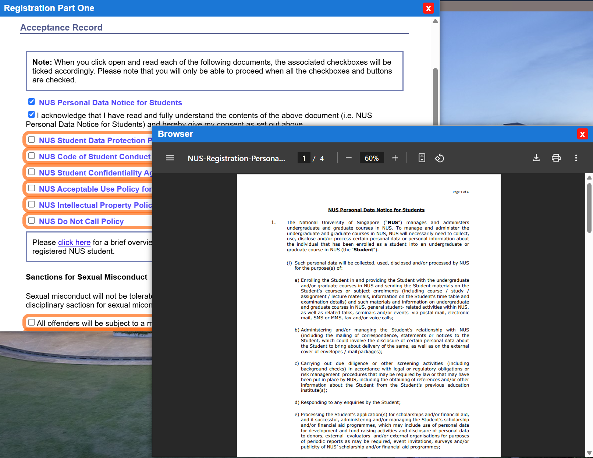
   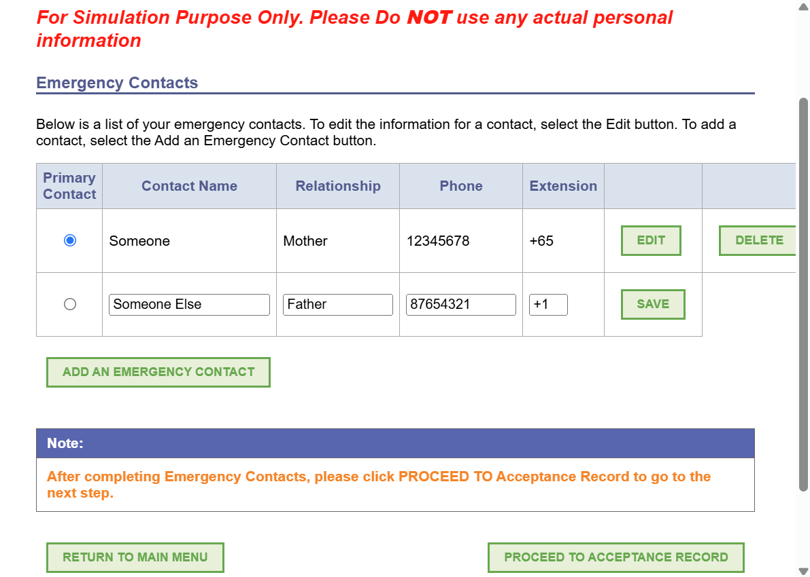

   - A simulated version of [Registration (Part One) for New Students](https://myregistration.nus.edu.sg/)
   - Contains a total of 14 pages (excluding login page): `AcceptanceRecord`, `AddressPage`, `AuthorisationMedicalPage`,`AuthorisationRepresentativePage`, `AuthorisationRequirementsPage`, `AuthorisationRequirementsPage`, `ContactPage`, `EmergencyContactsPage`, `FamilyFinancialPage`, `HealthSupportPage`, `MainMenuPage`, `PastOffencesPage`, `PersonalInformationPage`, `ViewCredentialsPage`
   - And 3 sub components: `RegistrationPageWrapper`, `StepSection`, `AddressSection`,
   - Implemented detailed guide for each of the input and button. There's a total of 71 player steps in this single task.
   - When all pages are completed, the player can confirm registration part one and proceed to view student credentials (NUSNET email, password, student ID).
   - All components can get player profile from context
   - To simulate the real website, all components accepts a prop `static`. When it is `true`, all `<input>`, `<select>` button becomes normal elements like `<div>`. This happens in confirmation page.
   - In debug mode, there will be buttons to complete each page immediately and complete all pages immediately to test each page, confirmation page and view student credentials page.
   - In real life this is a critical enrollment procedure as it unlocks the student account. However the university just put wait for an email for detailed information.

1. `src/renderer/apps/UHC`

   - Main Page

   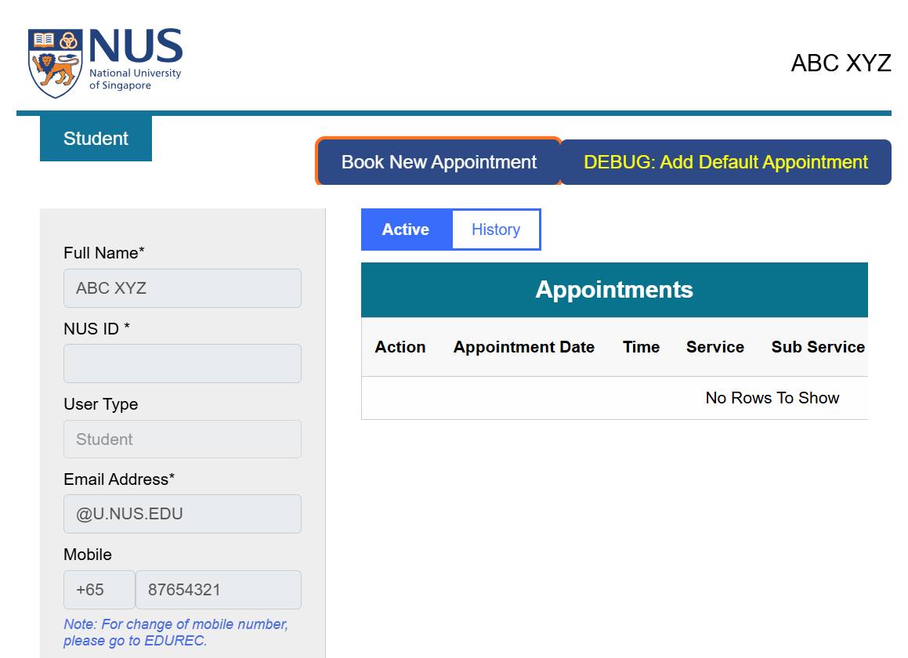

   - Appointment Booking Page Example (Step 2)

   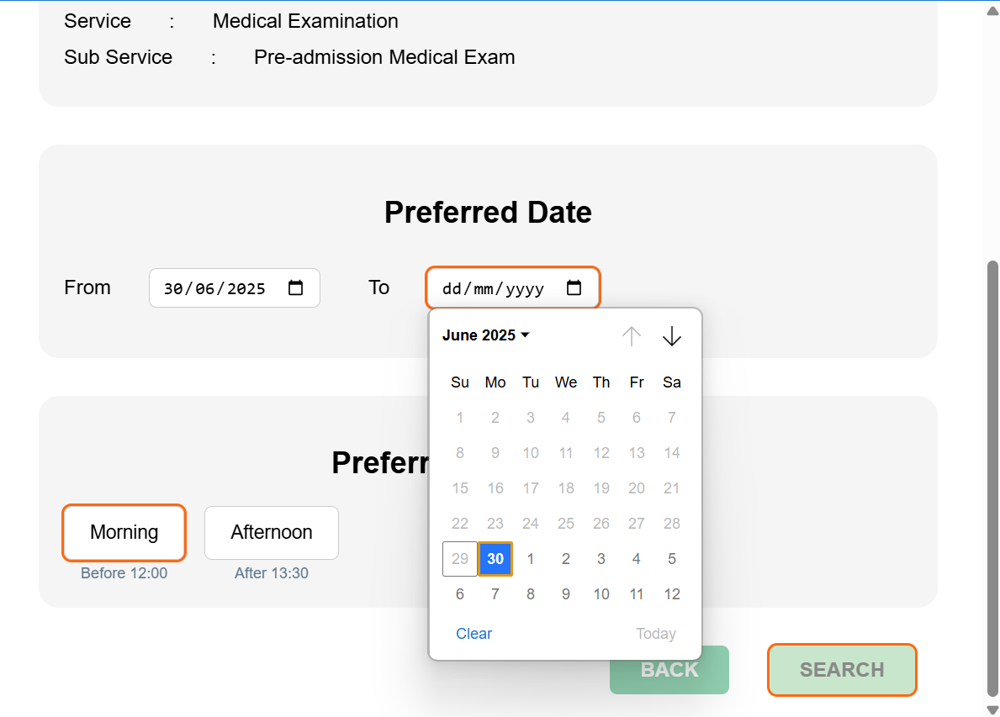

   - Check-in Page

   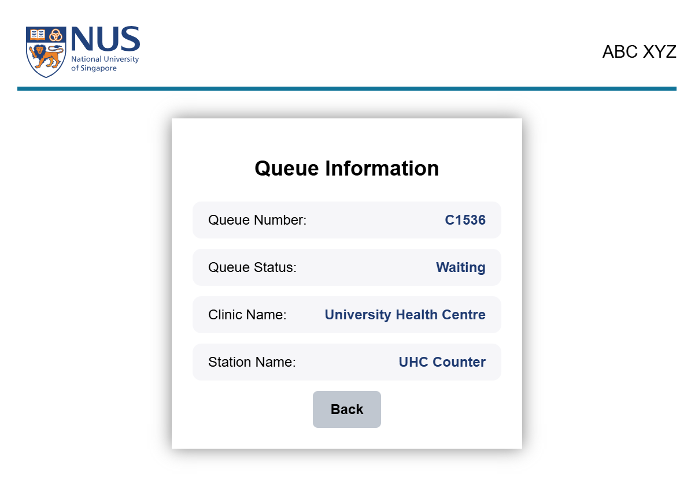

   - A simulated version of [Appointment Booking System for UHC](https://nusaqs.aisoft.sg/eappt/userappointmentslist)
   - Contains one main page to display the appintments and personal information, and 4 sub pages for the four steps to book an appointment, and additionally one check-in page which will be used in medical examination task.
   - 2 Sub components to display the available slots and the progress bar
   - Provides debug button to add an appointment with default settings to test check-in page and its functions
   - It syncs with the backend of the appointments and queue number after check-in.

## Credits

As of **Milestone 2**, we used the following assets in SimuNUS:

### Icons

- **Email Icon**  
  `public/icon/email.svg`  
  Created by [Pixel perfect](https://www.flaticon.com/authors/pixel-perfect) – [Flaticon](https://www.flaticon.com/free-icon/email_726623)

- **Bus Stop Icons**  
  `unity/Assets/Sprites/bus-stop.png`  
  `unity/Assets/Sprites/bus-stop-current.png`  
  Created by [sonnycandra](https://www.flaticon.com/authors/sonnycandra) – [Flaticon](https://www.flaticon.com/free-icon/bus-stop_15092025)

- **Airplane Icon**  
  `unity/Assets/Sprites/airplane.png`  
  Plane icons created by [Mihimihi](https://www.flaticon.com/authors/mihimihi) – [Flaticon](https://www.flaticon.com/free-icon/airplane_7893979)

- **MRT Icon**  
  `unity/Assets/Sprites/subway.png`  
  MRT icons created by [icon_small](https://www.flaticon.com/authors/icon_small) – [Flaticon](https://www.flaticon.com/free-icon/subway_8595872)

### Background Images

- **NUS Entrance**  
  `unity/Assets/images/nus-entrance-A.jpg`  
  Source: [NUS College of Design and Engineering News](https://cde.nus.edu.sg/news-detail/nus-announces-new-college-of-design-and-engineering/)

- **UTown Aerial View**  
  `public/background/utown.jpg`  
  Source: [NUS News - Greener Campus](https://news.nus.edu.sg/creating-a-greener-and-more-sustainable-campus/)

- **Online Application Portal Header**  
  `public/background/oam-header-bg.png`  
  Source: [NUS Applicant Portal](https://myaces.nus.edu.sg/applicantPortal/)

- **Canvas Login Background**  
  `public/background/login.svg`  
  Source: [NUS Canvas Login](https://www.nus.edu.sg/canvas/login/)

- **Singapore MRT Map**  
  `unity/Assets/images/Singapore-map.png`  
  Source: [MRT.sg](https://mrt.sg/map)

### Unity Assets

- **2D Furniture Pixel Art**  
  `unity/Assets/Furniture_pixel_art_assets`  
  Title: _2D-Basic-Room-Assets_  
  Author: PixelChad ([itch.io](https://pixelchad.itch.io), 08nickaz.06@gmail.com)  
  Source: [Unity Asset Store](https://assetstore.unity.com/packages/2d/2d-basic-room-assets-234762)

- **Hints & Rewards Sound Effects**  
  `unity/Assets/HintsStarsLite`  
  Title: _Hints Stars Points & Rewards Sound Effects – Lite Pack_  
  Author: Cyberwave Orchestra (cyberwaveorchestra@gmail.com, [Patreon](https://www.patreon.com/c/cyberwave?redirect=true))  
  Source: [Unity Asset Store](https://assetstore.unity.com/packages/audio/sound-fx/hints-stars-points-rewards-sound-effects-lite-pack-295538)

- **Clean Settings UI**  
  `unity/Assets/Clean Settings UI`  
  Title: _Clean Settings UI_  
  Author: Landan Lloyd ([Website](https://www.landanlloyd.com), landanlloyd@me.com)  
  Source: [Unity Asset Store](https://assetstore.unity.com/packages/tools/gui/clean-settings-ui-65588)

- **Toast Notification Message**  
  `unity/Assets/ToastNotificationMessage`  
  Title: _Toast Notification Message_  
  Author: Conrado Saud ([Website](https://conradosaud.com.br), conradosaud@gmail.com)  
  Source: [Unity Asset Store](https://assetstore.unity.com/packages/tools/gui/toast-notification-message-278006)

- **Dialogue System**  
  `unity/Assets/HeneGames/Dialogue System`  
  Title: _Dialogue System_  
  Author: HeneGames ([itch.io](https://henegames.itch.io), rento.henegames@gmail.com)  
  Source: [Unity Asset Store](https://assetstore.unity.com/packages/tools/gui/dialogue-system-248969)

### NUS Brand & Transport Colours

From the official [NUS Brand Guidelines](https://www.nus.edu.sg/identity/guidelines/corporate-colours):

- **NUS Orange**: `#EF7C00`
- **NUS Blue**: `#003D7C`

**Bus Line Colours**:

- A1: `#FF0000`
- A2: `#E3CE0B`
- D1: `#C075E1`
- D2: `#6F1B6F`
- K: `#345A9B`
- E: `#16B050`
- BTC: `#EF8136`
- L: `#BFBFBF`

### Reference Materials & Design Sources

Some layouts and flow of our simulated apps are directly inspired by actual NUS portals, websites, and official PDF guides. The following resources were referenced to make our simulations as realistic as possible:

- **Applicant Portal**  
  Layout based on [NUS Applicant Portal demo](https://www.youtube.com/watch?v=1bt8qKldkKM)

- **UHC Appointment System**  
  Based on official guide: [UHC Student User Guide (PDF)](https://www.nus.edu.sg/uhc/docs/default-source/myuhc/student_userguide.pdf)

- **Registration Part I**  
  Simulated using layout and instructions from: [User Guide for Registration Part One (UG)](https://nus.edu.sg/registrar/docs/info/academic-activities/registration/user-guide-for-reg-%28part-one%29-%28ug%29.pdf)

- **Student’s Pass (STP) Application**  
  Modeled after: [STP Application Guide – SCALE](https://scale.nus.edu.sg/docs/default-source/admissions/STP-guide-I4-MEM.pdf)

- **Photo Submission Requirements**  
  Referenced from: [Photograph Submission Guide (PDF)](https://nus.edu.sg/registrar/docs/default-source/academic-activities/registration/requirements-of-photograph-for-online-submission.pdf)

---

#### Note & Suggestion

Many of these official resources were difficult (or impossible) to find on official guidelines — they are often buried under `please refer to…` links or scattered across different department sites. To my surprise, I only found several of these most useful and practical guide pdfs via Google Images while searching for screenshots of their layout to design the simulated apps.

**IT WOULD BE OF GREAT HELP FOR future students if NUS could integrate these valuable guides into its guide and time table, instead of empty `please refer to`s**. Even if these documents are created and maintained by different departments, unifying them under a single onboarding resource would be far more helpful for incoming freshmen.
